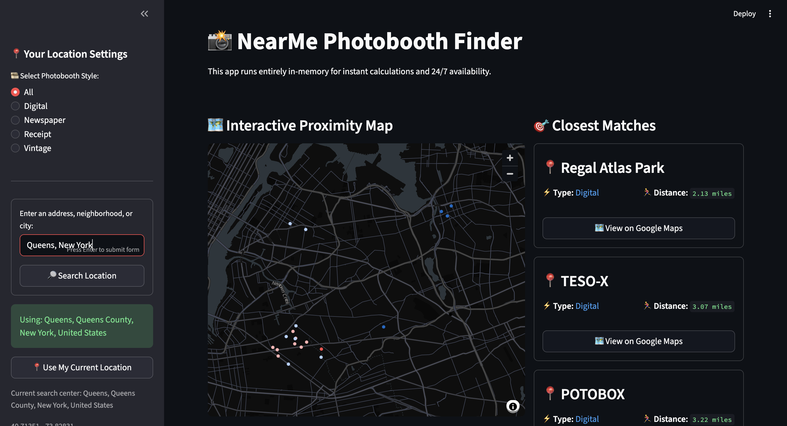

# 📸 Photobooth Finder

An interactive geospatial data application for discovering nearby photobooths and analyzing local photobooth availability.

Photobooth Finder transforms a personally curated dataset of 500+ photobooth locations into a searchable, location-aware application. The project combines **data collection, ETL, data validation, SQL, geospatial analysis, visualization, and interactive web development** to help users identify nearby photobooths and understand how availability varies by location and style.

**Live App:** https://photobooth-finder.streamlit.app/

## Application Preview



---

## Overview

Finding photobooths can be surprisingly difficult. Information is often scattered across social media, personal recommendations, Google Maps listings, and word of mouth.

I originally began collecting interesting photobooth locations in a personal Google Maps collection. As the collection grew to more than 500 locations, I wanted to turn that information into something that could be searched and analyzed more easily.

The result is Photobooth Finder: an end-to-end data application that takes raw Google Maps location data, processes and validates it, calculates geographic proximity, and presents the results through an interactive Streamlit interface.

---

## Data Collection

The dataset contains **500+ personally curated photobooth locations** collected from sources including:

* Personal experiences
* Word of mouth
* Social media
* Community recommendations
* Online location research

The collection includes several photobooth styles:

* Digital
* Vintage
* Receipt
* Newspaper

All locations were initially saved inside a custom Google Maps collection.

The collection was later exported through **Google Takeout** as CSV data so it could be transformed into a structured dataset for analysis and application development.

---

## ETL & Data Processing Pipeline

The exported Google Takeout data was not immediately suitable for analysis because geographic information was embedded within Google Maps URL structures rather than provided as clean latitude and longitude columns.

Instead of manually restructuring hundreds of records, I built a Python-based ETL pipeline.

```text
Google Maps Collection
        │
        ▼
Google Takeout CSV
        │
        ▼
Coordinate Extraction
        │
        ▼
Data Cleaning & Standardization
        │
        ▼
Data Quality Validation
        │
        ▼
MySQL Database
        │
        ▼
Processed Application Dataset
        │
        ▼
Geospatial Analysis
        │
        ▼
Streamlit Application & Analytics
```

### Coordinate Extraction

The pipeline uses regular expressions to recognize multiple Google Maps URL coordinate formats and extract latitude and longitude pairs programmatically.

This converts otherwise difficult-to-use location metadata into structured geographic fields.

### Data Cleaning

The pipeline also standardizes categorical data, including photobooth style labels, and corrects known inconsistencies within the source dataset.

### Data Validation

Before loading the processed records into the database, the pipeline performs several data-quality checks, including:

* Required-column validation
* Missing title detection
* Missing URL detection
* Missing photobooth style detection
* Latitude validation
* Longitude validation
* Duplicate location detection
* Unexpected category detection
* Coordinate extraction success-rate calculation

The raw dataset is kept separate from the processed dataset so the original source data remains preserved.

---

## Geospatial Proximity Engine

The core application logic calculates the geographic distance between a user's selected location and every valid photobooth in the dataset.

Using `geopy.distance.geodesic`, the application calculates distance across an ellipsoidal model of the Earth rather than treating latitude and longitude as ordinary Cartesian coordinates.

The application then:

1. Receives the user's selected latitude and longitude
2. Calculates the distance to each valid photobooth
3. Creates a dynamic `distance_miles` field
4. Sorts locations by proximity
5. Filters results by photobooth style
6. Returns the closest matches

This allows users to find the nearest available photobooths based on their actual search location.

---

## Location Search

Users can search by:

* Street address
* Neighborhood
* City
* Browser geolocation

Manual location searches are converted into coordinates using **OpenStreetMap Nominatim through GeoPy**.

The selected location is stored using Streamlit session state so results remain consistent across interface updates and filter changes.

---

## Local Coverage Analytics

Photobooth Finder also includes an analytics layer that converts the location dataset into decision-oriented coverage metrics.

For any selected location, the application calculates:

* Distance to the nearest photobooth
* Number of photobooths within 1 mile
* Number of photobooths within 5 miles
* Number of photobooths within 10 miles
* Photobooth distribution across distance bands
* Photobooth style distribution within 10 miles

The application also generates a short interpretation of the results.

For example, it can determine whether a selected location has:

* Strong immediate photobooth availability
* Moderate nearby availability
* Limited nearby coverage

These metrics allow the application to do more than return search results—it also helps users understand the geographic availability of photobooths around them.

---

## Features

### 🔎 Location Discovery

* Search by address, neighborhood, or city
* Use browser-based current location
* Dynamically calculate nearby photobooths
* Rank results by geographic distance

### 🎞️ Photobooth Style Filtering

Users can filter results by:

* Digital
* Vintage
* Receipt
* Newspaper

### 🗺️ Geographic Visualization

* Display nearby photobooths on a map
* Highlight nearby results
* Show calculated distance from the selected location
* Open individual locations directly in Google Maps

### 📊 Analytics

* Nearest-booth distance
* 1-mile coverage
* 5-mile coverage
* 10-mile coverage
* Distance-band visualization
* Style-distribution visualization
* Automatically generated coverage insights

---

## Technology Stack

### Data Processing

* **Python**
* **Pandas**
* **Regular Expressions**
* **SQL**

### Database

* **MySQL**
* **SQLAlchemy**
* **PyMySQL**

### Geospatial Analysis

* **GeoPy**
* **OpenStreetMap Nominatim**
* **Geodesic distance calculations**

### Application

* **Streamlit**
* **FastAPI**

### Visualization

* **Altair**
* **Streamlit mapping tools**

---

## Project Structure

```text
photobooth-finder/
│
├── app.py
├── api.py
├── requirements.txt
├── README.md
│
├── data/
│   ├── raw/
│   │   └── photobooths_raw.csv
│   │
│   └── processed/
│       └── clean_booths.csv
│
├── scripts/
│   ├── import_data.py
│   ├── export_data.py
│   └── find_booths.py
│
└── sql/
    └── data_quality_checks.sql
```

---

## Key Files

### `app.py`

Main Streamlit application containing:

* Location search
* Browser geolocation
* Photobooth filtering
* Distance calculations
* Mapping
* Coverage analytics
* Data visualizations

### `api.py`

FastAPI backend that exposes photobooth location functionality programmatically.

### `scripts/import_data.py`

Handles the main ETL workflow:

* Loads raw Google Takeout data
* Extracts coordinates
* Standardizes photobooth styles
* Performs data-quality validation
* Loads processed records into MySQL

### `scripts/export_data.py`

Queries validated records from MySQL and generates the processed CSV used by the deployed application.

### `scripts/find_booths.py`

Implements database querying and proximity calculations for nearby photobooths.

### `sql/data_quality_checks.sql`

Contains SQL queries used to inspect and validate stored location records.

---

## Running the Application Locally

### 1. Clone the repository

```bash
git clone https://github.com/prarwas/photobooth-finder.git
cd photobooth-finder
```

### 2. Create a virtual environment

```bash
python3 -m venv .venv
source .venv/bin/activate
```

### 3. Install dependencies

```bash
pip install -r requirements.txt
```

### 4. Run the Streamlit application

```bash
streamlit run app.py
```

The user-facing application reads from the processed dataset stored in:

```text
data/processed/clean_booths.csv
```

A local MySQL instance is therefore not required simply to run the Streamlit interface.

---

## Running the Data Pipeline

The ETL workflow uses MySQL for structured data storage.

Database credentials are managed using environment variables and are excluded from version control.

Create a `.env` file in the project root:

```text
MYSQL_USER=your_username
MYSQL_PASSWORD=your_password
MYSQL_HOST=127.0.0.1
MYSQL_PORT=3306
MYSQL_DATABASE=photobooth_project
```

Then run:

```bash
python3 scripts/import_data.py
```

This processes and validates the raw dataset before loading it into MySQL.

To regenerate the application dataset:

```bash
python3 scripts/export_data.py
```

---

## Design Decisions

### Why use Python for the ETL process?

The original Google Takeout export required additional coordinate parsing and categorical cleanup before it could be used effectively in a relational database.

Building the transformation process in Python allowed the cleaning workflow to become reproducible rather than requiring hundreds of records to be manually modified.

### Why separate raw and processed data?

The original dataset is preserved in `data/raw/`, while cleaned application-ready records are stored separately in `data/processed/`.

This makes transformations easier to reproduce and prevents cleaning operations from permanently changing the source data.

### Why use MySQL?

MySQL provides structured storage for cleaned location records and allows SQL-based validation and querying during data preparation.

### Why use a processed CSV for deployment?

The database is useful during the data-engineering workflow, while a processed CSV provides a lightweight and portable source for the public Streamlit application.

This separates data preparation from application deployment and avoids exposing database credentials in the hosted application.

### Why use geodesic distance?

Latitude and longitude represent locations on the Earth's surface.

Using geodesic distance accounts for the Earth's ellipsoidal shape and provides a more appropriate geographic distance calculation than treating coordinates as points on a flat plane.

---

## Current Limitations

* Results depend on the completeness of the manually curated dataset.
* Some regions contain significantly more photobooth data than others.
* Geographic distance does not represent driving, walking, or public-transit travel time.
* Photobooth availability may change after a location has been added.
* Some source records may contain incomplete or inconsistent metadata.
* Nominatim search results depend on external geocoding availability.

---

## Future Development

Planned improvements include:

* Progressive Web App (PWA) support
* Improved mobile usability
* Expanded global photobooth coverage
* Better location verification workflows
* Additional geographic analytics
* Advanced filtering options
* Continued FastAPI backend development
* Improved community contribution workflows
* Data freshness and location-status tracking

---

## What I Learned

Building Photobooth Finder required working across the full lifecycle of a data application:

* Collecting a real-world dataset
* Converting unstructured location information into structured data
* Designing an ETL pipeline
* Validating imperfect records
* Working with SQL and relational databases
* Performing geospatial calculations
* Building an interactive application
* Creating visual analytics
* Translating numerical results into user-facing insights

The project started as a personal collection of photobooth locations and evolved into an end-to-end data application designed to make that information easier to search, analyze, and use.
